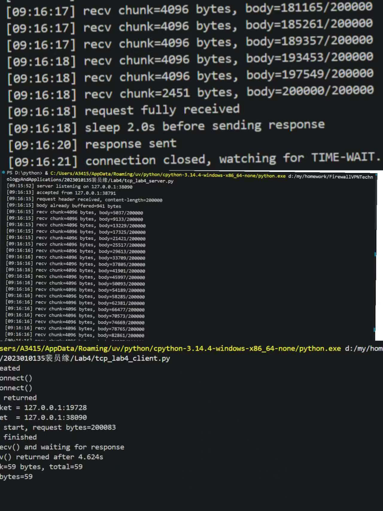
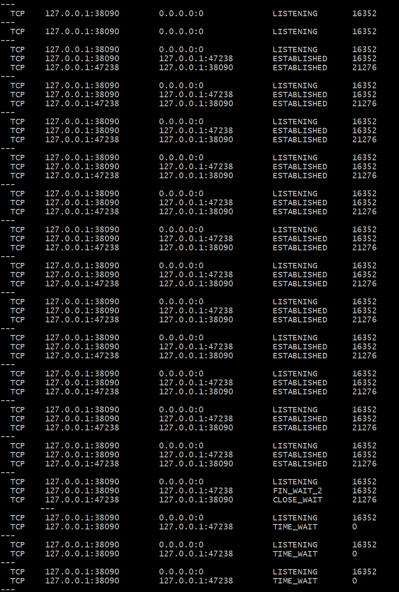
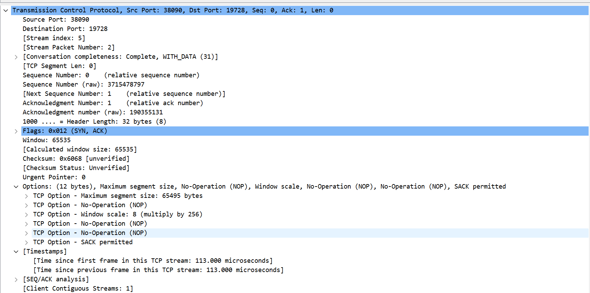
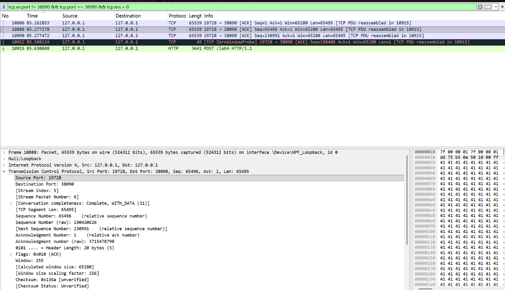
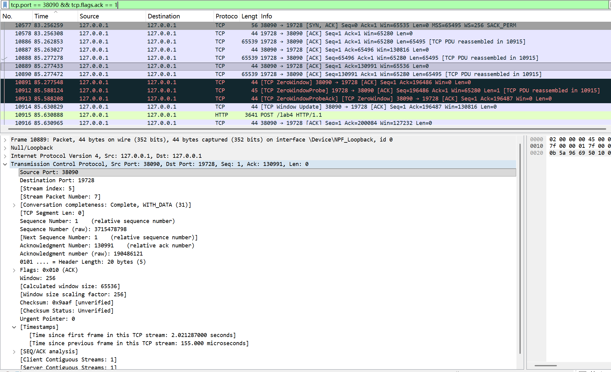
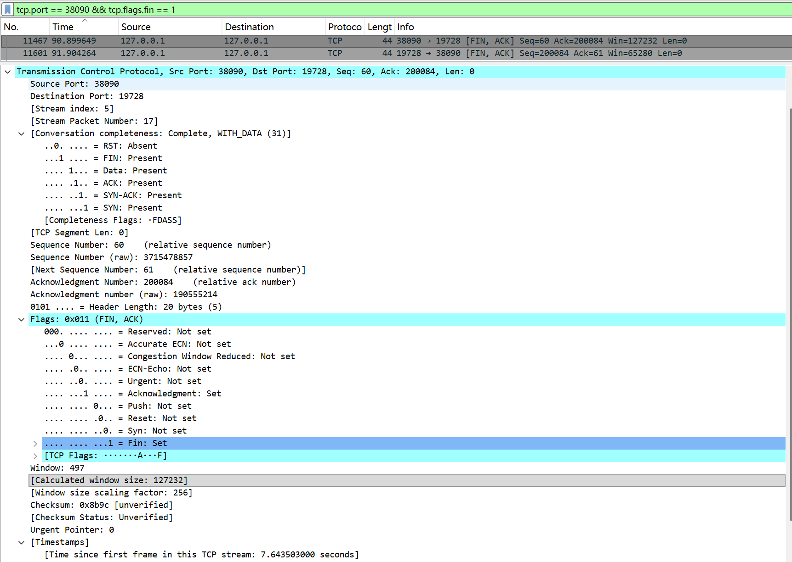

# Lab4：看见TCP 我不怕不怕啦

## 实验背景

本实验围绕一条 TCP 连接的完整生命周期展开，重点观察以下内容：

1. `socket()`、`listen()`、`accept()`、`connect()` 的职责区别
2. "连接"为什么本质上是交换控制信息而不是物理连线
3. TCP 头部中的端口号、序号、ACK 号、标志位、窗口、头部长度、可选字段
4. 三次握手如何建立收发准备
5. 应用层大块数据如何被 TCP 按 MSS 拆分
6. `Sequence Number` 与 `Acknowledgment Number` 如何配合工作
7. `recv()` 为什么会阻塞等待数据
8. 接收窗口如何反映接收方处理能力
9. ACK 与窗口更新为什么常常会被合并
10. `FIN` / `ACK` 如何完成断开
11. 为什么连接结束后套接字不会立刻删除

---

## 实验任务

### 任务一：准备实验环境并记录运行信息

**第一步：准备好四个窗口**

整个实验需要同时观察多个界面，建议在开始前把窗口布局摆好：

- **终端 A**：运行服务端
- **终端 B**：运行客户端
- **终端 C**：持续监控套接字状态（全程保持开启，不要关）
- **Wireshark**：抓包

**第二步：在终端 C 里启动持续监控**

TCP 状态变化很快，等你手动敲完 `ss` 命令再回车，状态可能已经过去了。用下面的命令让终端 C 每 0.5 秒自动刷新一次，之后只需要盯着这个窗口就行：

```bash
# Linux
watch -n 0.5 'ss -tan | grep 38090'

# macOS（没有 watch，用循环代替）
while true; do netstat -an | grep 38090; echo "---"; sleep 0.5; done

# Windows（Git Bash执行）
while true; do netstat -ano | grep 38090; echo "---"; sleep 0.5; done
```

如果你换了端口，把 `38090` 替换成实际端口。

**第三步：打开 Wireshark，选回环接口，填好过滤器，开始抓包**

回环接口在不同系统里名字不同：

| 系统 | 接口名 |
|:-----|:-------|
| Linux | `lo` |
| macOS | `lo0` |
| Windows | `Adapter for loopback traffic capture`（需提前安装 Npcap 并勾选回环支持） |

在显示过滤器里输入：

```text
tcp.port == 38090
```

然后点击开始抓包（蓝色鲨鱼鳍图标）。**先开始抓包，再运行脚本**，否则握手包会被漏掉。

**第四步：启动脚本**

```bash
# 终端 A
python3 tcp_lab4_server.py

# 终端 B（等服务端打印出 server listening on ... 后再运行）
python3 tcp_lab4_client.py
```

如果 `38090` 已被占用，两端都加环境变量换端口，同时记得把 Wireshark 过滤器和终端 C 里的端口号也改掉：

```bash
LAB4_PORT=38123 python3 tcp_lab4_server.py
LAB4_PORT=38123 python3 tcp_lab4_client.py
```

**第五步：填写下表**

| 项目                                | 你的填写内容 |
| :---------------------------------- | :----------- |
| 服务端监听地址                      |127.0.0.1|
| 服务端监听端口                      |38090|
| 客户端本地临时端口                  |127.0.0.1:19728|
| 客户端请求总字节数                  |200083|
| 服务端响应内容                      |HTTP/1.1 200 OK  Content-Length: 2 Connection: close| 
| 客户端 `connect()` 返回前后的时间点 |09:22:34|
| 客户端首次收到响应前等待了多久      |4.624s|

各项数值均可直接从终端输出读取：服务端监听信息在 `server listening on ...`，客户端本地端口在 `local socket = ...`，请求字节数在 `sendall() start, request bytes=...`，等待时间在 `first recv() returned after ...s`。



---

### 任务二：观察套接字创建与连接建立

1. 服务端启动后，观察终端 C 出现 `LISTEN` 状态，截图留存。
2. 在终端 B 里启动客户端，观察它依次打印 `socket created`、`calling connect()`、`connect() returned`。
3. 客户端打印 `connect() returned` 之后，观察终端 C 出现 `ESTABLISHED`，截图留存。脚本在 `connect()` 返回后有 2 秒停顿，这段时间足够截图。

填写下表：

| 阶段                             | 你的填写内容 |
| :------------------------------- | :----------- |
| 服务端启动、客户端未连入时的状态 |LISTEN（监听）状态|
| `connect()` 返回后服务端状态     |ESTABLISHED（已建立连接）状态|
| `connect()` 返回后客户端状态     |ESTABLISHED（已建立连接）状态|

简答题：

1. 服务端在客户端连接前为什么处于 `LISTEN`？
答：服务端完成 socket() 创建套接字、bind() 绑定地址端口、listen() 开启监听后，会进入 LISTEN（监听）状态。这个状态的作用是被动等待客户端发起连接请求，持续监听指定端口上的 SYN 报文，为后续三次握手做准备，是 TCP 服务端建立连接前的标准等待状态


2. 为什么这时还没有真正建立 TCP 连接？
答：TCP 连接需完成三次握手才能建立，LISTEN 状态下服务端仅完成本地监听，未收到客户端连接请求，三次握手未启动，因此连接未真正建立

3. `socket()` 与 `connect()` 的区别是什么？
答：socket()：创建套接字，分配内核资源，仅完成套接字对象的创建，无状态变化，是连接前的准备操作。
connect()：主动发起连接，发送 SYN 报文启动三次握手，客户端从 CLOSED 转为 SYN-SENT 状态，是连接建立的核心操作。

4. 为什么 `connect()` 返回后才进入可稳定收发数据的状态？
答：connect() 是阻塞函数，会等待三次握手完全完成、连接成功建立后才返回。只有三次握手完成，双方进入 ESTABLISHED 状态，参数协商一致，才具备可靠传输的基础，可稳定收发数据。


5. 为什么"网线一直连着"不等于"TCP 连接已经建立"？
答：网线连通是物理层 / 数据链路层的硬件连通，仅代表链路可传输数据；TCP 连接是传输层的逻辑连接，需通过三次握手完成参数协商与状态同步。物理连通只是 TCP 连接的前提，不代表逻辑连接已建立。


6. 这里的"连接"更准确地说是在做什么？
答：TCP 的 "连接" 本质是客户端与服务端的逻辑状态同步与参数协商过程：通过三次握手确认双方初始序号、窗口等传输参数，同步 TCP 状态机，在两端内核维护连接控制块，是端到端的虚拟逻辑连接，而非物理链路连接。




---

### 任务三：观察三次握手与 TCP 头部字段

**定位握手包**：在 Wireshark 过滤器里输入下面的条件，可以屏蔽中间的数据包，只留下握手和断开阶段的控制包：

```text
tcp.port == 38090 && (tcp.flags.syn == 1 || tcp.flags.fin == 1)
```

包列表最前面的三个包就是三次握手（SYN → SYN-ACK → ACK）。

**找到各字段的位置**：点击某个握手包，在下方详情栏展开 `Transmission Control Protocol`。源端口、目的端口、Seq、Ack、Flags、Window、Header Length 都在这里。TCP 选项在最底部的 `Options` 子项里，展开后可以看到 MSS、Window Scale、SACK Permitted，注意这三项只出现在带 SYN 标志的包里，纯 ACK 包里没有。

**关于序号显示**：Wireshark 默认开启相对序号，会把每个方向的初始序号归零显示，所以 SYN 包的 Seq 看起来是 `0`，而不是真实的随机大数。这是正常现象，实验报告按 Wireshark 显示的值填写即可。如果你想看真实值，可以去 `Edit → Preferences → Protocols → TCP` 里取消勾选 `Relative sequence numbers`。

填写下表：

| 报文       | 源端口 | 目的端口 | Seq  | Ack  | Flags | Window | Header Length |
| :--------- | :----- | :------- | :--- | :--- | :---- | :----- | :------------ |
| 第一次握手 |19728|38090|0|0|SYN|65535|32 字节|
| 第二次握手 |38090|19728|0|1|SYN, ACK|65535|32字节|
| 第三次握手 |19728|38090|1|1|ACK|65535|32字节|

第一次握手（SYN）的 Ack 字段在 Wireshark 里通常显示为空或 `0`，这是正常的，因为此时客户端还没有收到服务端的任何数据。Header Length 在没有选项时是 20 字节，握手包因为携带了 MSS 等选项通常是 28 或 32 字节。

| TCP 选项       | 你的填写内容 |
| :------------- | :----------- |
| MSS            |65495 字节|
| Window Scale   |8|
| SACK Permitted |是（已开启）|

回环接口的 MSS 通常是 65495（因为回环 MTU 是 65536，比以太网的 1500 大得多），这会影响后续任务五里是否能观察到分段。

简答题：

1. 发送方和接收方端口号在连接阶段的作用是什么？
答：端口号用于唯一标识主机上的不同应用进程。在 TCP 连接建立阶段，源端口标识发送方的应用进程，目的端口标识接收方的应用进程，让数据能准确交付到对应进程，是 TCP 实现 “端到端” 通信的核心标识


2. TCP 头部如何帮助找到目标套接字？
答：TCP 头部包含源 IP、源端口、目的 IP、目的端口四元组信息。操作系统内核通过这四元组，唯一匹配到对应的套接字（socket），将收到的报文准确交付给该套接字对应的应用进程。


3. 为什么初始序号不是简单固定从 1 开始？
答:初始序号（ISN）采用随机生成的方式，而非固定从 1 开始，核心是为了防止历史连接的延迟报文干扰新连接，避免序号混淆导致数据错乱，提升 TCP 连接的安全性与可靠性。


4. 为什么 TCP 可选字段更容易在连接阶段看到？
答：TCP 的可选字段（如 MSS、窗口缩放、SACK 等）用于协商连接建立阶段的传输参数，仅在三次握手的 SYN 报文中携带，用于双方同步传输能力；数据传输阶段通常不再携带这些选项，因此在连接阶段更容易观察到。




---

### 任务四：区分头部中的控制信息和套接字中的控制信息

用以下过滤器分别找到两类报文：

```text
# 纯控制报文（无应用数据）
tcp.port == 38090 && tcp.len == 0

# 携带应用数据的报文
tcp.port == 38090 && tcp.len > 0
```

从纯控制报文里选一个（SYN、纯 ACK 或 FIN-ACK 都可以），从数据报文里选一个（客户端发请求或服务端发响应的包）。

填写下表：

| 项目                   | 你的填写内容 |
| :--------------------- | :----------- |
| 纯控制报文的类型       |SYN+ACK|
| 携带应用数据的报文类型 |PSH+ACK|
| 头部中的控制信息举例   |Flags（SYN/ACK/PSH 标志位）、Sequence Number、Acknowledgment Number、Window 大小|
| 套接字中的控制信息举例 |连接状态（ESTABLISHED）、发送 / 接收缓冲区大小、超时重传计时器、拥塞窗口大小|

简答题：

1. 为什么"头部中的控制信息"和"套接字中的控制信息"不是同一件事？

头部控制信息是 “网线另一端的约定”，用来规范数据怎么在网络上跑；套接字控制信息是 “本机手里的账本”，用来管理这条连接的本地资源与状态


---

### 任务五：观察数据分段、序号与 ACK

客户端发送的请求体是 200000 字节，超过了回环接口 MSS（约 65495 字节），因此应该可以在 Wireshark 里看到多个连续的数据段。用下面的过滤器找到客户端发出的数据包：

```text
tcp.srcport != 38090 && tcp.port == 38090 && tcp.len > 0
```

在包列表里连续选几个数据段，对比它们的 Seq 值。相邻两段的关系是：后一段的 Seq = 前一段的 Seq + 前一段的 TCP Segment Len。

找服务端返回给客户端的纯 ACK 报文：

```text
tcp.srcport == 38090 && tcp.flags.ack == 1 && tcp.len == 0
```

填写下表：

| 数据段  | Seq  | Ack  | TCP Segment Len | Flags |
| :------ | :--- | :--- | :-------------- | :---- |
| 第 1 段 |1|1|65495|ACK, PSH|
| 第 2 段 |65496|1|65495|ACK, PSH|
| 第 3 段 |130991|1|65495|ACK, PSH|

| ACK 报文 | Ack Number | Flags | Window |
| :------- | :--------- | :---- | :----- |
| 第 1 个  |65496|ACK|65280|
| 第 2 个  |130991|ACK|65280|
| 第 3 个  |196486|ACK|65280|

| 项目                         | 你的填写内容 |
| :--------------------------- | :----------- |
| 是否发生分段                 |是|
| 握手中观察到的 MSS           |65495 字节|
| 单段长度与 MSS 的关系        |单段长度等于 MSS|
| ACK 号大致确认到了第几个字节 |第 1 个 ACK 确认到 65496 字节，第 2 个到 130991 字节，第 3 个到 196486 字节|

简答题：

1. 应用程序是否直接决定每个网络包的数据长度？为什么？
答：不直接决定。应用仅将数据交给内核发送缓冲区，TCP 报文段长度由内核根据 MSS、滑动窗口、网络状态动态决定，应用无法直接控制。


2. 大块应用数据为什么会被拆分？
答：受MSS 限制，避免 IP 分片；拆分后便于 TCP 累计确认和重传，保障可靠传输。


3. `MSS` 与 `MTU` 的关系是什么？
答：MSS = MTU - IP 头部长度 - TCP 头部长度。MTU 是链路最大传输单元，MSS 是 TCP 最大分段大小，MSS 由 MTU 推导而来，确保 TCP 段不超过链路传输限制。


4. "一次 `sendall()`"与"一个 TCP 包"之间是什么关系？
答：无固定对应关系。一次sendall()是逻辑写入，内核会将大块数据拆分为多个 TCP 包传输，即 1 次sendall()对应 N 个 TCP 包


5. 为什么 ACK 体现的是累计确认？
答：ACK 号代表期望收到的下一个字节序号，确认该序号前的所有数据已完整接收，无需逐包确认，提升传输效率。


6. 如果中间某一段丢失，ACK 会出现什么变化？
答：接收方会持续重复发送以丢失段起始序号为 ACK 号的报文；发送方收到 3 次重复 ACK 或超时后，触发重传机制





---

### 任务六：观察 `recv()` 阻塞与窗口字段

`recv()` 的等待时间直接从客户端终端读取，`calling recv() and waiting for response` 到 `first recv() returned after ...s` 之间就是等待时长，脚本已经帮你计算好了。

在 Wireshark 里找窗口值：用过滤器 `tcp.port == 38090 && tcp.flags.ack == 1` 列出所有 ACK 包，点击其中一个，在详情栏 `Transmission Control Protocol` 里找 `Window` 字段。如果同时显示了 `Calculated window size`，优先看这个值，它已经把 Window Scale 的缩放算进去了，是对方实际能接收的字节数。

如果包列表的 Info 列出现了 `[TCP Window Update]` 标注，说明这个包的主要目的是通知对方窗口变化，重点观察它的 `Window` 字段。

填写下表：

| 项目                                   | 你的填写内容 |
| :------------------------------------- | :----------- |
| 客户端开始调用 `recv()` 的时间         |09:22:35.768594|
| 客户端第一次收到响应的时间             |09:22:35.774834|
| `recv()` 是否立刻返回                  |否|
| 首次收到响应前等待了多久               |约 0.006 秒|
| `recv()` 等待期间连接是否已经建立      |是|
| 第 1 个 ACK 报文的窗口值               |65280|
| 第 2 个 ACK 报文的窗口值               |65280|
| 第 3 个 ACK 报文的窗口值               |130816|
| 窗口值是否变化                         |是|
| 若变化，变化趋势                       |前两个 ACK 窗口值保持稳定，第三个 ACK 窗口值大幅增大（窗口更新，通知发送方接收缓冲区恢复，可继续发送数据）|
| ACK 与窗口更新是否可以出现在同一个包中 |是|
| 是否看到 RTT 或 ACK 往返时间相关信息   |是|

简答题：

1. "连接建立"和"应用收到数据"之间是什么关系？
"连接建立" 是 "应用收到数据" 的前提，只有 TCP 三次握手完成、连接进入 ESTABLISHED 状态，应用才能通过 recv/read 接收数据，连接未建立则无法进行数据传输与交付


2. 为什么说 `read` / `recv` 在数据未到达时会被挂起？
阻塞模式下，recv/read 的设计逻辑是等待数据到位再返回，若内核接收缓冲区无数据，调用进程会被挂起，直到数据到达、连接断开或超时才被唤醒，因此数据未到达时会被挂起


3. 窗口字段反映了接收方哪方面的能力？
窗口字段反映了接收方的流量控制能力，具体是接收方接收缓冲区的当前空闲空间大小，窗口值代表接收方当前可接收的数据量


4. 为什么发送方不能无限制连续发送数据？
发送方不能无限制连续发送数据，一是为避免接收方缓冲区溢出导致数据丢失，二是受 MSS、MTU 及网络拥塞状态限制，无限制发送会造成网络丢包，同时接收方通过窗口字段动态限制发送速率，防止压垮接收方。


5. 滑动窗口为什么既提高效率又避免压垮接收方？
滑动窗口通过允许发送方连续发送窗口内多个未确认报文，减少等待 ACK 的次数，提升传输效率；同时窗口大小由接收方动态调整，限制发送方连续发送量，确保接收方缓冲区有足够空间处理数据，避免压垮接收方，实现流量控制


---

### 任务七：观察响应返回与双向 `seq/ack`

TCP 的 Seq/Ack 是双向独立的，客户端有自己的发送序号，服务端有自己的发送序号。用下面的过滤器只看服务端发出的数据包（源端口是 38090，有应用数据）：

```text
tcp.srcport == 38090 && tcp.len > 0
```

紧跟在服务端数据包后面的、客户端发出的 ACK 包，其 Ack Number 确认的就是服务端的发送序号。

填写下表：

| 项目                     | 你的填写内容 |
| :----------------------- | :----------- |
| 服务端响应数据报文的 Seq |1|
| 服务端响应数据报文的 Ack |200084|
| 客户端确认报文的 Ack     |60|

简答题：

1. 为什么 TCP 的 `seq/ack` 是双向分别计算的？
TCP 是全双工通信协议，客户端与服务端是两个独立的发送 / 接收实体，各自维护独立的发送序列号空间：服务端的 Seq 用于标识自身发送的响应数据，客户端的 Seq 用于标识自身发送的请求数据；双向的 Ack 分别用于确认对端发送的数据，保障两个方向数据传输的可靠性，因此需要分别计算序列号与确认号。


2. 为什么双方都需要各自的初始序号？
TCP 是全双工协议，客户端和服务端要同时独立收发数据，必须各自维护一套独立的序列号空间；如果只用一套序号，两个方向的序号会混乱冲突，无法区分哪段数据属于哪个方向；初始序号（ISN）用于保证连接的唯一性和防旧连接混淆，同时为双向数据传输提供独立的起始标识，保障可靠传输


3. 为什么发送应用数据时报文通常仍然带 `ACK`？
TCP 是面向确认的可靠协议，ACK 用于确认对端数据；发送数据时带 ACK，是为了捎带确认，无需单独发送 ACK 包，既确认了对端之前发送的数据，又携带自身应用数据，减少网络报文数量，提升传输效率，同时保证双向数据传输的可靠性


---

### 任务八：观察连接断开与套接字延迟删除

用下面的过滤器精确定位所有带 FIN 的包：

```text
tcp.port == 38090 && tcp.flags.fin == 1
```

通常会看到两个 FIN 包（双方各一个）。看第一个 FIN 包的源端口，就能判断谁先发起断开。

**关于 TIME-WAIT**：TIME-WAIT 只出现在主动发起关闭的一方（先发 FIN 的那端）。服务端脚本在 `conn.close()` 之后会继续运行 10 秒再退出，这段时间可以在终端 C 里观察 TIME-WAIT。Linux 上 TIME-WAIT 通常持续约 60 秒，macOS 上可能较短，如果没有观察到请如实说明。

填写下表：

| 项目                                    | 你的填写内容 |
| :-------------------------------------- | :----------- |
| 谁先发送 FIN                            |服务端|
| 关闭阶段共观察到几个带 FIN 的报文       |2个|
| 最终 ACK 是否可见                       |可见|
| 关闭后是否观察到 `TIME-WAIT` 或等价现象 |是|

简答题：

1. 为什么关闭连接不能只发一个结束通知？
TCP 是全双工连接，通信双方各自独立维护发送 / 接收通道，必须通过四次挥手完成双向关闭：主动关闭方发 FIN 表示己方不再发送数据，被动关闭方回 ACK 确认，待被动方数据传输完成后再发 FIN，主动方回最终 ACK，才能彻底关闭两个方向的连接，仅发一个通知无法保证双向数据都传输完成，会导致数据丢失。


2. 为什么连接结束后套接字不会立刻删除？
主动关闭方需要维持TIME-WAIT 状态（持续 2MSL，约 60 秒）：一是确保最后一个 ACK 能被对端收到，若 ACK 丢失，对端重发 FIN 时，TIME-WAIT 状态的套接字可重发 ACK；二是防止旧连接的延迟报文被新连接误接收，保证网络中所有报文都自然消亡，避免连接混淆。


3. 如果最后一个 ACK 丢失，而旧套接字已经立刻删除，可能带来什么问题？
若最后一个 ACK 丢失，被动关闭方会因未收到 ACK 而重发 FIN，但主动方套接字已删除，无法响应重发的 FIN，会向被动方发送 RST 复位报文，导致被动方连接异常中断；同时，旧连接的延迟报文可能被新建立的同端口连接误接收，造成数据错乱，破坏 TCP 连接的可靠性




---

## 问答题

1. TCP 的"连接"到底意味着什么？它为什么不是"把网线连上"？
TCP 连接是端到端的逻辑连接，指通信双方通过三次握手，在操作系统内核中维护一套包含序列号、窗口、状态等的连接状态，用于保障数据可靠传输。网线连接是物理层的硬件连通，仅提供数据传输的物理通道，不包含任何状态管理和可靠性保障，因此二者本质不同


2. 三次握手为什么能让双方进入可通信状态？
三次握手通过双向确认，让客户端和服务端互相确认对方的发送、接收能力正常：客户端发 SYN 同步初始序号，服务端回 SYN+ACK 确认客户端序号并同步自身序号，客户端再发 ACK 确认服务端序号。握手完成后，双方都明确了对端的初始序号、窗口大小，同步了连接状态，因此可进入可靠通信状态


3. TCP 头部中的控制字段如何支撑收发数据？
TCP 头部的 SYN 用于建立连接、同步初始序号；ACK 用于确认已接收数据，保障可靠性；FIN 用于优雅关闭连接；PSH 用于通知对端立即将数据交付应用；RST 用于强制复位异常连接；窗口字段用于流量控制，限制发送方速率，这些字段协同工作，支撑了 TCP 的连接管理、可靠传输、流量控制等核心功能。


4. ACK、窗口、等待时间为什么会共同影响 TCP 的可靠传输？
ACK 实现累计确认，保障数据被对端正确接收，丢失则触发重传；窗口字段实现流量控制，避免发送方压垮接收方；等待时间（超时重传时间）保障数据丢失时能及时重传，三者协同：ACK 确认可靠性，窗口控制传输速率，等待时间处理丢包异常，共同保障 TCP 的可靠传输


5. 断开连接为什么仍然需要严格的控制信息交换？
TCP 是全双工连接，需通过四次挥手双向关闭：主动方发 FIN 表示己方不再发送数据，被动方回 ACK 确认，被动方数据传输完成后再发 FIN，主动方回最终 ACK。严格的控制信息交换能确保双方数据都传输完成，避免数据丢失，同时保障 TIME-WAIT 状态的正常执行，防止旧连接报文干扰新连接。


6. 如果服务端根本没有启动，客户端调用 `connect()` 时会看到什么现象？
客户端调用connect()后，会向服务端发送 SYN 包，因服务端未启动，无进程响应 SYN，服务端会回复 RST 包，客户端connect()调用失败，返回连接被拒绝的错误，应用会收到连接异常的提示。


7. 如果中途人为制造丢包，ACK、重传、窗口之间会出现什么变化？
数据丢包后，接收方会持续发送以丢包起始序号为 ACK 号的重复 ACK；发送方收到 3 个重复 ACK 或超时后，触发快速重传或超时重传，重发丢失的报文；同时，接收方窗口会因未处理完数据而暂时减小，待重传数据处理完成后恢复，窗口更新会通知发送方继续传输。


8. 如果把客户端发送的数据改得更大，窗口字段和分段情况会如何变化？
数据更大时，会超过 MSS 限制，TCP 会将数据拆分为更多个 MSS 大小的分段进行传输；窗口字段会根据接收方的接收缓冲区状态动态调整，若接收方处理能力足够，窗口保持稳定，若接收方处理不及时，窗口会暂时减小，待数据处理完成后恢复。


9. 如果把服务端读取速度改得更慢，是否更容易看到窗口更新甚至零窗口？
是。服务端读取速度变慢，接收缓冲区会被快速填满，当缓冲区满时，服务端会发送窗口值为 0 的零窗口报文，通知客户端停止发送；当服务端读取数据、缓冲区腾出空间后，会发送窗口更新报文，通知客户端恢复发送，因此更易观察到零窗口和窗口更新现象。


---

## 截图要求

- 截图须清晰，终端文字和 Wireshark 字段可读。
- 所有截图与本 `Lab4.md` 放在同一目录下。
- 命名规范：

| 截图内容               | 文件名                  |
| :--------------------- | :---------------------- |
| 服务端与客户端运行结果 | `run.png`               |
| `ss` 状态变化          | `states.png`            |
| 三次握手与 TCP 选项    | `handshake_header.png`  |
| 大请求分段与 MSS       | `segmentation.png`      |
| ACK 与窗口观察         | `ack_window.png`        |
| 断开与最终状态         | `teardown_timewait.png` |

具体要求：

1. `run.png`：终端截图，至少能看到服务端 `server listening on ...`、客户端 `calling connect()`、`connect() returned`、`calling recv() and waiting for response`、`first recv() returned after ...s`。

2. `states.png`：终端截图，至少能看到 `LISTEN`、`ESTABLISHED`，以及 `TIME-WAIT`（若能观察到）。推荐截 `watch` 命令的持续输出画面，可以在一张截图里同时展示多个状态的变化过程。

3. `handshake_header.png`：Wireshark 截图，至少能看到三次握手中某个包的 `Source Port`、`Destination Port`、`Sequence Number`、`Acknowledgment Number`、`Flags`、`Window`，以及 `Options` 中的 `Maximum segment size`、`Window Scale`、`SACK Permitted`。

4. `segmentation.png`：Wireshark 截图，至少能看到客户端发送数据的 TCP 包的 `TCP Segment Len`、`Seq`、`Ack`。若能观察到分段，尽量截出多个连续数据段。

5. `ack_window.png`：Wireshark 截图，至少能看到一个或多个 ACK 报文的 `Acknowledgment Number`、`Window`，以及 `Calculated window size`（若显示）、`[TCP Window Update]`（若出现）。

6. `teardown_timewait.png`：Wireshark 截图或 Wireshark 与终端截图的拼图，至少能看到带 `FIN` 的包，以及 `TIME-WAIT` 状态（若能观察到）。

---

## 提交要求

在自己的文件夹下新建 `Lab4/` 目录，提交以下文件：

```text
学号姓名/
└── Lab4/
    ├── Lab4.md
    ├── tcp_lab4_server.py
    ├── tcp_lab4_client.py
    ├── run.png
    ├── states.png
    ├── handshake_header.png
    ├── segmentation.png
    ├── ack_window.png
    └── teardown_timewait.png
```

---

## 截止时间

2026-04-23，届时关于 Lab4 的 PR 请求将不会被合并。
